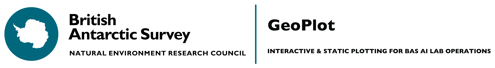

# GeoPlot
>GeoPlot is an interactive and static plotting toolkit that is leveraged by several projects across the British Antarctic Survey Artificial Intelligence Lab (BAS AI) used in combinations with additional software packages being developed. 

## Manual Pages

All information on the installation and usage of this software can be found at the manual pages [LINK](https://github.com/antarctica/GeoPlot/wiki).

## Installation
The software package can be installed by downloading the github repo by running the examples below. This software package requires GDAL and Fiona to be pre-installed, this is not an issue with MacOS/Linux installs but additional steps must be taken for Windows install. These additional steps are as follows

windows only:
```
    pip install pipwin
    pipwin install gdal
    pipwin install fiona
    pipwin install cartopy
```

For the installation of the GeoPlot run one of the following:

source install:
```
python setup.py install
```

pip install:
```
pip install bas-geoplot
```
see [PyPI](https://pypi.org/project/bas-geoplot/) page for more info

## Command Line Interface

Once installed, bas-geoplot can be used to generate plots of geospatial data, including meshes generated by polar-route. To generate and interactive plot from a polar-route mesh:

```
plot_mesh <mesh.json>
```
optional arguments are:
```
-v '(turn on verbose logging)'
-o '(set output location for plot)'
-s '(create a static plot as opposed to an interactive html file)'
```

## Development & Contributions
Development of software package is conducted by the [BAS AI Lab](https://www.bas.ac.uk/team/science-teams/ai-lab/).

For contruibutions and feature additions please contact [jonsmi@bas.ac.uk](jonsmi@bas.ac.uk).


## License
Distributed under the MIT license. See ``LICENSE`` for more information.

[version]: https://img.shields.io/GeoPlot/v/datadog-metrics.svg?style=flat-square
[downloads]: https://img.shields.io/GeoPlot/dm/datadog-metrics.svg?style=flat-square
